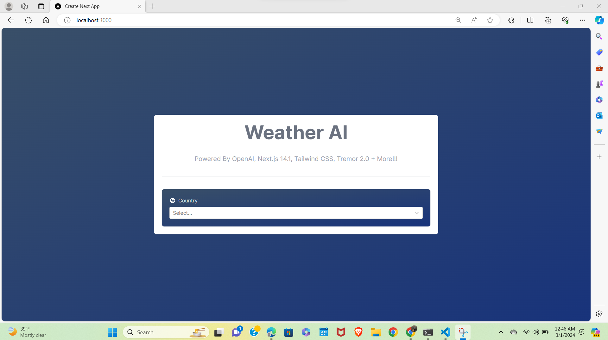
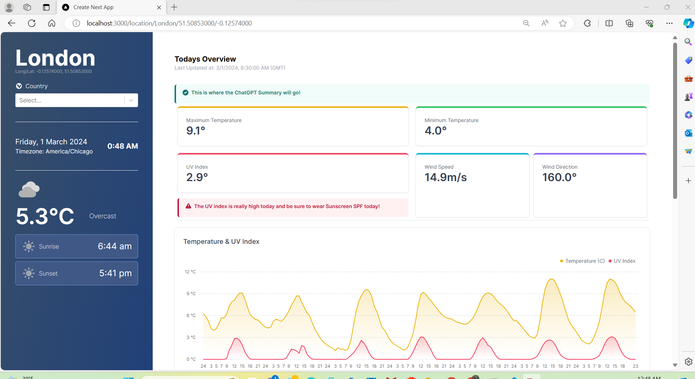
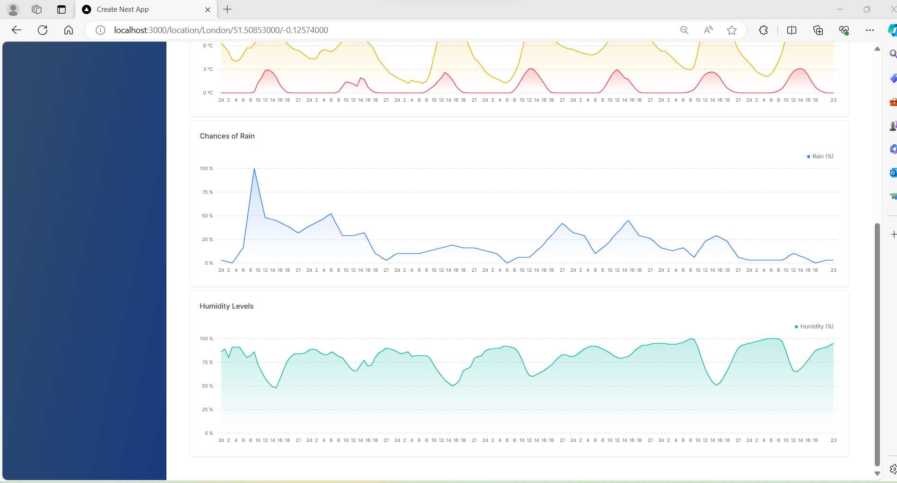

 Libraries used are:

1. Tremor 2.0 for creating the beautiful UI like the dashboard
2. React.js
3. Next.js  13.3
4. StepZen for the GraphQL end point
5. Taiwind CSS
6. Typescript
7. Vercel

Aim: The main aim of this project is to create a Weather AI enabled app to provide all the live parameters of the Weather in any area accross the globe by using the latest Frontend technologies like the React.js, Next.js, Tailwind CSS and Club it with the latest Large Language Model technology like OpenAI. By doing so we will Integrate the LLM capabilities with the Weather application!

Note: This is a Live project!

These include the demo of the created project:
1. This is the opening page In which we can select the country and the city according to our requirements.

2. After Selecting the Country and the city, it will be directed to a weather information page which consisting of the information panel and the main section as shown in the below.

